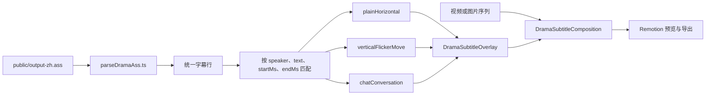

# 字幕项目结构与配置修改指南

本文档说明当前 Remotion 项目的字幕渲染流程、目录职责，以及普通横排、竖排逐字特效和聊天场景三类字幕的配置方法。

## 1. 项目当前能力

广播剧字幕与原弹幕功能相互独立。广播剧字幕目前支持三类总特效：

| 类型     | `kind`         | `effectId`            | 用途                                   |
| -------- | -------------- | --------------------- | -------------------------------------- |
| 普通横排 | `horizontal`   | `plainHorizontal`     | 常规多人广播剧字幕、自动换行、分行定位 |
| 竖排逐字 | `vertical`     | `verticalFlickerMove` | 从右向左分列、逐字出现、闪烁、定向移动 |
| 聊天场景 | `conversation` | `chatConversation`    | 左右头像、气泡消息、历史消息累计       |

未匹配到任何特效规则的 ASS 句子会自动使用 `plainHorizontal`，因此普通横排字幕不需要逐句配置。

## 2. 渲染流程



主要步骤如下：

1. `DramaSubtitleComposition` 加载视频或图片序列，并与字幕一起导出。
2. `DramaSubtitleTransparentComposition` 只加载字幕层，用于导出透明字幕视频。
3. `DramaSubtitleOverlay` 加载 ASS 和本地字体。
4. `parseDramaAss` 提取说话人、文本、开始时间和结束时间。
5. 每句字幕只允许匹配一个总特效。
6. 未匹配句子自动走普通横排字幕。
7. 竖排句子读取对应的逐字帧时间轴。
8. 聊天句子按 `sceneId` 聚合成一个持续存在的聊天场景。

## 3. 目录结构

```text
my-danmaku-video/
├─ public/
│  ├─ output-zh.ass
│  ├─ 闪烁特效原视频.mp4
│  ├─ 空白背景.mp4
│  ├─ fonts/
│  │  ├─ drama-title.ttf
│  │  └─ klee-one-regular.ttf
│  └─ reference-frames/
│     ├─ frame-000000.png
│     ├─ frame-000001.png
│     └─ ...
├─ src/
│  ├─ Root.tsx
│  ├─ DramaSubtitleComposition.tsx
│  ├─ DramaSubtitleTransparentComposition.tsx
│  ├─ DramaSubtitleOverlay.tsx
│  ├─ dramaSubtitleMedia.ts
│  ├─ parseDramaAss.ts
│  ├─ dramaTitleFont.ts
│  ├─ dramaSubtitleConfigs/
│  │  ├─ index.ts
│  │  ├─ media.ts
│  │  ├─ assLines.ts
│  │  ├─ horizontal.ts
│  │  ├─ vertical.ts
│  │  ├─ conversation.ts
│  │  ├─ presets/
│  │  │  └─ eurekaLine007FlickerPreset.ts
│  │  └─ timelines/
│  │     ├─ helpers.ts
│  │     ├─ eureka.ts
│  │     └─ eurekaLine007JapaneseReference.ts
│  └─ subtitleEffects/
│     ├─ registry.ts
│     ├─ types.ts
│     ├─ style.ts
│     ├─ timeline.ts
│     ├─ plainHorizontal.tsx
│     ├─ verticalFlickerMove.tsx
│     └─ chatConversation.tsx
├─ package.json
└─ SUBTITLE_PROJECT_GUIDE.md
```

### 3.1 核心渲染文件

| 文件                                          | 职责                                              |
| --------------------------------------------- | ------------------------------------------------- |
| `src/Root.tsx`                                | 注册 Remotion Composition，自动读取视频尺寸和时长 |
| `src/DramaSubtitleComposition.tsx`            | 组合背景媒体与字幕 Overlay                        |
| `src/DramaSubtitleTransparentComposition.tsx` | 只渲染透明背景上的字幕 Overlay                    |
| `src/DramaSubtitleOverlay.tsx`                | 加载 ASS、匹配特效、合并位置与样式                |
| `src/dramaSubtitleMedia.ts`                   | 背景和透明合成共用的媒体来源类型                  |
| `src/parseDramaAss.ts`                        | 把 ASS 对话解析成统一字幕行                       |
| `src/dramaTitleFont.ts`                       | 加载本地标题字体和 Klee One                       |

### 3.2 配置文件

| 文件                                                                   | 应该修改的内容                                   |
| ---------------------------------------------------------------------- | ------------------------------------------------ |
| `src/dramaSubtitleConfigs/media.ts`                                    | ASS、视频、图片序列                              |
| `src/dramaSubtitleConfigs/assLines.ts`                                 | output-zh.ass 全部 24 句的时间、文本和稳定编号   |
| `src/dramaSubtitleConfigs/horizontal.ts`                               | 普通横排位置、默认样式、说话人样式、特定横排句子 |
| `src/dramaSubtitleConfigs/vertical.ts`                                 | 竖排句子匹配、整句位置、时间轴注册               |
| `src/dramaSubtitleConfigs/presets/eurekaLine007FlickerPreset.ts`       | Eureka line007 人工逐帧参数，不包含具体文字      |
| `src/dramaSubtitleConfigs/timelines/eureka.ts`                         | 《Eureka》24 句竖排分栏、逐字帧和单句覆盖        |
| `src/dramaSubtitleConfigs/timelines/helpers.ts`                        | 自动初始时间轴、逐字覆盖和配置类型               |
| `src/dramaSubtitleConfigs/timelines/eurekaLine007JapaneseReference.ts` | Eureka line007 原日文参考，不参与当前渲染        |
| `src/dramaSubtitleConfigs/conversation.ts`                             | 聊天场景、参与者和聊天句子                       |
| `src/dramaSubtitleConfigs/index.ts`                                    | 汇总三类句子匹配规则                             |

### 3.3 特效实现文件

配置与实现已经分离：

| 文件                      | 实现                                     |
| ------------------------- | ---------------------------------------- |
| `plainHorizontal.tsx`     | HTML 横排文字                            |
| `verticalFlickerMove.tsx` | 竖排、逐字闪烁和定向减速移动             |
| `chatConversation.tsx`    | 头像、气泡、消息累计和入场动画           |
| `registry.ts`             | 注册所有总特效                           |
| `types.ts`                | 特效、时间轴和聊天场景的 TypeScript 类型 |

## 4. 常用命令

安装依赖：

```bash
npm install
```

启动 Remotion Studio：

```bash
npm run dev
```

主字幕 Composition：

```text
http://localhost:3000/DramaSubtitleVideo
```

透明字幕 Composition：

```text
http://localhost:3000/DramaSubtitleTransparent
```

聊天预览 Composition：

```text
http://localhost:3000/DramaSubtitleChatPreview
```

格式化 TypeScript：

```bash
npm run format
```

检查 ESLint 和 TypeScript：

```bash
npm run lint
```

构建 Remotion Bundle：

```bash
npm run build
```

渲染指定帧：

```bash
npx remotion still DramaSubtitleVideo output.png --frame=182
```

已有 `build/` 时，可以避免重新打包：

```bash
npx remotion still build DramaSubtitleVideo output.png --frame=182
```

导出视频：

```bash
npx remotion render DramaSubtitleVideo output.mp4
```

导出透明字幕 MOV：

```bash
npm run render:subtitle:transparent
```

输出文件为：

```text
out/drama-subtitles-transparent.mov
```

这个命令固定使用 `ProRes 4444` 和 alpha 像素格式，适合继续导入 Premiere Pro。不要只执行不带透明参数的 `remotion render ...mov`，当前 Remotion CLI 可能退回到不含 alpha 的 ProRes HQ。

等价的完整命令：

```bash
npx remotion render DramaSubtitleTransparent out/drama-subtitles-transparent.mov --codec=prores --image-format=png --pixel-format=yuva444p10le --prores-profile=4444
```

当前 Composition 为 30fps，`--frame=30` 表示第 1 秒，帧编号从 0 开始。

## 5. ASS 文件约定

当前 ASS 文件由 `src/dramaSubtitleConfigs/media.ts` 中的以下配置指定：

```ts
export const DRAMA_SUBTITLE_ASS = "output-zh.ass";
```

文件实际路径为：

```text
public/output-zh.ass
```

广播剧字幕渲染只读取：

- 说话人
- 字幕文本
- 开始时间
- 结束时间

字体、字号、描边和位置主要由 TypeScript 配置控制，不依赖 ASS Style。

`output-zh.ass` 的全部 24 句已经按出现顺序同步到：

```text
src/dramaSubtitleConfigs/assLines.ts
```

每句都有稳定编号 `line001` 到 `line024`，保存精确的 `startMs`、`endMs` 和 `text`。修改 ASS 的文字或时间后，需要同步更新这里的对应项。

说话人的读取顺序：

1. 优先读取 ASS Dialogue 的 `Name` 字段。
2. `Name` 为空时，尝试从 `说话人: 文本` 或 `说话人：文本` 中提取。

解析后的时间包含两套单位：

| 字段                              | 单位 | 用途                    |
| --------------------------------- | ---- | ----------------------- |
| `startMs` / `endMs`               | 毫秒 | 精确匹配哪一句 ASS 字幕 |
| `startFrame` / `durationInFrames` | 帧   | Remotion 显示和动画     |

## 6. 句子特效匹配

使用文本和起止时间精确匹配一句字幕；ASS 的 `Name` 非空时再加入 `speaker`。当前目标句的 `Name` 为空，因此不匹配说话人：

```ts
match: {
  startMs: 47230,
  endMs: 54160,
  text: "就连一起走路也都只觉厌恶 但我并不是想要孤身一人啊",
}
```

匹配是严格相等：

- 空格不同会匹配失败。
- 标点不同会匹配失败。
- 起止时间差 1ms 也会匹配失败。
- 同一句匹配多个总特效会直接报错。

排查匹配失败时，应先核对 `public/output-zh.ass` 中的原始 Dialogue。

特效配置引用统一句子表，避免重复手写时间和文本：

```ts
match: dramaSubtitleAssLines.line001;
```

## 7. 媒体配置

文件：

```text
src/dramaSubtitleConfigs/media.ts
```

### 7.1 使用视频

```ts
export const DRAMA_MEDIA_SOURCE = DRAMA_VIDEO_MEDIA_SOURCE;
```

视频路径相对于 `public/`：

```ts
export const DRAMA_VIDEO_SRC = "Rokudenashi-Eureka-Premiere.mp4";
```

该视频与 `public/output-zh.ass` 使用相同的完整时间轴。视频宽度、高度和时长会由 `Root.tsx` 自动读取。

`闪烁特效原视频.mp4` 和 `reference-frames/` 只作为 `47.23-54.16` 秒片段的逐帧参考，不作为正式主合成时间轴。

### 7.2 使用图片序列

逐帧调闪烁时改为：

```ts
export const DRAMA_MEDIA_SOURCE = DRAMA_IMAGE_SEQUENCE_MEDIA_SOURCE;
```

图片序列配置：

```ts
export const DRAMA_IMAGE_SEQUENCE_MEDIA_SOURCE = {
  type: "imageSequence",
  directory: "reference-frames",
  filenamePrefix: "frame-",
  extension: "png",
  padLength: 6,
  startNumber: 0,
  frameCount: 208,
  width: 400,
  height: 450,
};
```

如果替换图片序列，需要同步修改：

- `frameCount`
- `width`
- `height`
- 文件名前缀
- 起始编号

提取图片序列示例：

```bash
ffmpeg -i public/输入视频.mp4 -start_number 0 public/reference-frames/frame-%06d.png
```

图片序列适合逐帧核对；最终导出可以切回 MP4。

### 7.3 透明字幕的尺寸和时长

透明字幕 Composition 不渲染背景视频，也不会包含背景音频。它只借用一个媒体配置来自动确定画布宽度、高度和总帧数：

```ts
export const DRAMA_TRANSPARENT_METADATA_SOURCE = DRAMA_VIDEO_MEDIA_SOURCE;
```

需要把透明字幕叠加到另一个视频时，应把这个配置指向最终底层视频对应的媒体来源。这样导出的透明字幕 MOV 会与底层视频拥有相同尺寸、帧率和时长。

两条导出路线互不影响：

- `DramaSubtitleVideo`：背景媒体和字幕一起导出。
- `DramaSubtitleTransparent`：只导出带 alpha 的字幕层。

部分播放器会把透明区域显示成黑色，这是播放器的预览底色，不代表透明通道丢失。可在 Premiere Pro 中叠到其他素材上确认。

## 8. 普通横排字幕

文件：

```text
src/dramaSubtitleConfigs/horizontal.ts
```

### 8.1 说话人与字幕行

```ts
export const dramaSubtitleRows = {
  speaker00: 1,
  speaker01: 2,
  speaker02: 3,
};
```

### 8.2 每一行的位置

```ts
export const dramaSubtitleRowPositions = {
  "1": {
    left: "18%",
    top: "32%",
    width: "84%",
  },
};
```

常用位置字段：

- `left` / `right`
- `top` / `bottom`
- `width` / `height`
- `maxWidth`
- `transform`

数字会按像素处理，也可以使用 `"12%"`、`"40vw"`、`"20px"`。

### 8.3 默认文字样式

```ts
export const dramaSubtitleDefaultStyle = {
  color: "#faa902",
  fontSize: 60,
  fontWeight: 900,
  outlineColor: "#ffffff",
  outlineWidth: 8,
  textAlign: "left",
};
```

横排文字需要限制宽度并换行时：

```ts
{
  width: 720,
  whiteSpace: "normal",
  overflowWrap: "break-word",
  wordBreak: "normal",
}
```

### 8.4 当前横排 assignment

当前 `output-zh.ass` 的 24 句全部使用竖排，因此：

```ts
export const horizontalSubtitleEffectAssignments = [];
```

横排渲染器和默认样式仍然保留，后续可以继续用于其他 ASS 或单独恢复某句横排。

## 9. 样式覆盖优先级

同名字段越靠后优先级越高：

1. Overlay 内置默认样式
2. `dramaSubtitleDefaultStyle`
3. 当前字幕行样式
4. 当前说话人样式
5. 总特效默认样式
6. 单句 `assignment.style`

需要确保某句竖排字幕使用指定字体或颜色时，优先写在该句的 `style` 中。

位置覆盖顺序：

1. Overlay 内置行位置
2. `dramaSubtitleRowPositions`
3. 总特效默认位置
4. 单句 `assignment.position`

## 10. 竖排逐字字幕

全片竖排配置分为三部分：

1. `assLines.ts`：保存 `output-zh.ass` 全部 24 句的精确时间与文本。
2. `timelines/eureka.ts`：按 ASS 顺序集中配置《Eureka》24 句的分栏、逐字时间轴和单句覆盖。
3. `vertical.ts`：生成 timeline 注册表和 24 条竖排 assignment，并校验没有漏句或重复 timelineId。

竖排字幕的默认值按作用域命名：

| 名称                                                                 | 作用域                                           |
| -------------------------------------------------------------------- | ------------------------------------------------ |
| `OVERLAY_BASE_STYLE`                                                 | 所有字幕进入特效前的基础样式                     |
| `VERTICAL_EFFECT_DEFAULT_STYLE`                                      | 所有 `verticalFlickerMove` 字幕的特效默认样式    |
| `RENDERER_FALLBACK_OPTIONS`                                          | 单字和 assignment 都未提供动画参数时的最终兜底   |
| `EUREKA_DEFAULT_VERTICAL_POSITION` / `EUREKA_DEFAULT_VERTICAL_STYLE` | 仅用于《Eureka》全部竖排句子                     |
| `timelineOptions` / `cueOverrides`                                   | 当前歌曲的整句自动参数和单字覆盖                 |
| `eurekaMotionProfiles.ts`                                            | 《Eureka》逐字出现帧、方向、距离、时长和闪烁窗口 |

### 10.1 一首歌一个配置文件

《Eureka》的全部字幕使用：

```text
src/dramaSubtitleConfigs/timelines/eureka.ts
```

每句是数组中的一个独立配置块，例如第一句：

```ts
defineEurekaAutoLine({
  lineId: "line001",
  columns: ["希望有谁能告诉我"],
  // timelineOptions: {cueOverrides: {0: {0: {atFrame: 1}}}},
}),
```

`lineId` 对应 `assLines.ts`。自动配置会根据 `lineId` 生成唯一的 `timelineId`，不需要重复填写。

### 10.2 文字列与列顺序

`eureka.ts` 中每个配置块都有自己的 `columns`，数组按画面从右向左排列：

```ts
defineEurekaAutoLine({
  lineId: "line005",
  columns: [
    "不去打起雨伞", // 第一列，画面最右
    "只待将自己淋湿",
    "就连自己的存在也只觉得无所谓", // 第三列，画面最左
  ],
}),
```

ASS 中的单空格和双空格用于初始分栏，不会渲染成竖排字符。`columns` 去除空格后必须与 ASS 文本完全一致，否则打开 Composition 时会报错。

### 10.3 字符数量校验

自动时间轴会根据 `columns` 生成相同数量的字符 cue。人工 preset 的字符数量仍然必须严格匹配，例如 `eureka.ts` 中的 `line007` 保留 `6、6、7、5` 的人工槽位。

常见错误：

```text
Character timeline mismatch
Vertical columns do not match ASS text
```

标点会被当作字符，ASS 分栏空格不会。

### 10.4 逐字参数

自动配置通过 `cueOverrides[列索引][字索引]` 覆盖单个字符。索引从 0 开始：

```ts
cueOverrides: {
  0: { // 第一列
    2: { // 第三个字
      atFrame: 19,
      animationDurationInFrames: 16,
      hiddenWindows: [
        {startFrame: 1, durationInFrames: 1},
        {startFrame: 3, durationInFrames: 1},
      ],
      moveDirection: "right",
      moveDistance: 16,
      spacingBefore: -3,
      spacingAfter: 6,
    },
  },
}
```

| 字段                        | 含义                                 |
| --------------------------- | ------------------------------------ |
| `atFrame`                   | 相对于 ASS 句子起始帧的出现时间      |
| `animationDurationInFrames` | 从初始位置减速移动到目标位置的总帧数 |
| `hiddenWindows`             | 相对于当前字 `atFrame` 的隐藏帧区间  |
| `moveDirection`             | 初始位置位于目标位置的哪个方向       |
| `moveDistance`              | 初始位置与目标位置的距离，单位为像素 |
| `spacingBefore`             | 与竖排上方字符的额外距离             |
| `spacingAfter`              | 与竖排下方字符的额外距离             |

移动方向可选：

```ts
"top" | "right" | "bottom" | "left";
```

移动使用 `Easing.out(Easing.cubic)`，开始较快，接近目标时逐渐减速。

### 10.5 闪烁配置

出现后隐藏第 1 帧：

```ts
hiddenWindows: [{ startFrame: 1, durationInFrames: 1 }];
```

出现后闪两次：

```ts
hiddenWindows: [
  { startFrame: 1, durationInFrames: 1 },
  { startFrame: 3, durationInFrames: 1 },
];
```

连续隐藏两帧：

```ts
hiddenWindows: [{ startFrame: 1, durationInFrames: 2 }];
```

不闪烁：

```ts
hiddenWindows: [];
```

### 10.6 单字间距

竖排中：

- `spacingBefore` 控制与上方字符的距离。
- `spacingAfter` 控制与下方字符的距离。
- 正数拉开。
- 负数靠近。

示例：

```ts
spacingBefore: -3,
spacingAfter: 6,
```

也可以使用 CSS 长度：

```ts
spacingBefore: "0.1em",
spacingAfter: "8px",
```

### 10.7 列间距

整列之间的距离通过特效选项控制：

```ts
effectOptions: {
  columnGap: 40,
  softBlurPx: 0.35,
}
```

`columnGap` 是列与列之间的距离，不是同列字与字的距离。
`softBlurPx` 用于柔化字形、描边和发光边缘，默认值为 `0.35`；设置为 `0` 可以关闭柔化。

### 10.8 自动初始参数和单句覆盖

除 `line007` 外，初始时间轴会把字符均匀分布在 ASS 句子持续时间内，默认不隐藏字符、移动 16px、动画 16 帧，方向按右、上、左、下循环。可以在对应配置块的 `timelineOptions` 中覆盖生成参数：

```ts
defineEurekaAutoLine({
  lineId: "line001",
  columns: ["希望有谁能告诉我"],
  timelineOptions: {
    animationDurationInFrames: 20,
    moveDistance: 24,
    endPaddingInFrames: 12,
    moveDirections: ["left", "top"],
    cueOverrides: {
      0: {
        0: {atFrame: 5}, // 第一栏第一个字在当前句第 5 帧出现
        1: {atFrame: 12},
      },
    },
  },
}),
```

`atFrame` 相对于当前 ASS 句子的起始帧。未写入 `cueOverrides` 的字符继续使用自动生成时间；需要逐字精修时，可以同时覆盖该字的出现帧和动画参数。

《Eureka》除 `line007` 外的句子都会加载 `timelines/eurekaMotionProfiles.ts`。该文件把出现帧和动画参数保存在同一个元组中：

```ts
// [出现帧, 移动方向, 移动距离, 动画帧数, 闪烁模式]
[6, "bottom", 17, 19, 0];
```

`line001`～`line005` 按中文字符直接保存，一项就是一个中文字。`line006`、`line008`～`line024` 按原日文参考字符槽位保存；由于中日文字数不同，中文会根据字符在同栏中的相对位置插值出现帧，并采样最接近的日文动画参数。每栏第一个元组的 `atFrame` 是该栏的起始出现帧，最后一个元组的 `atFrame` 是结束出现帧，因此不再单独配置 `columnFrameRanges`。`line007` 继续使用人工校准的 preset。

单字参数优先级从低到高为：渲染器兜底值、自动时间轴默认值、原视频运动 profile、`cueOverrides`。因此需要人工修正某个中文字时，仍然只需在 `eureka.ts` 对应句子的 `cueOverrides[列索引][字索引]` 中填写参数。

整句位置、样式和列间距直接写在同一个配置块中，与 `timelineOptions` 同级：

```ts
position: {right: "8%", top: "10%", width: "60%", height: "80%"},
style: {fontSize: 46, letterSpacing: 2},
effectOptions: {columnGap: 40},
```

### 10.9 修改现有句子

修改 `output-zh.ass` 的某一句时：

1. 在 `assLines.ts` 同步修改对应 `lineXXX` 的时间和文本。
2. 打开 `timelines/eureka.ts`，搜索对应的 `lineId`。
3. 修改该配置块的 `columns`，决定从右向左如何分栏。
4. 按需修改自动参数、`cueOverrides`、`position`、`style` 和 `effectOptions`。
5. 打开 Studio 对应时间点，运行时校验会检查文本和配置覆盖范围。

`vertical.ts` 不需要逐句手工修改，它会从统一配置表自动生成 24 条 assignment。

### 10.10 新增或删除 ASS 句子

新增一句时必须同时完成：

1. 在 `assLines.ts` 增加新的稳定 lineId。
2. 在 `timelines/eureka.ts` 的 `eurekaVerticalTimelineConfigs` 中按时间顺序增加配置块。

删除句子时反向删除这两处。配置覆盖不完整或 timelineId 重复时，Composition 会直接报错，不会静默回退成横排。

`eureka.ts` 中的 `line007` 是例外：它绑定 `eurekaLine007FlickerPreset.ts`，保留人工逐帧确认的 6、6、7、5 字配置；其他 23 句使用自动初始时间轴并支持逐字覆盖。

## 11. 日文参考时间轴

文件：

```text
src/dramaSubtitleConfigs/timelines/eurekaLine007JapaneseReference.ts
```

这份配置保存从原日文图片序列提取的参数，仅用于：

- 对照原片出现帧。
- 对照闪烁窗口。
- 对照移动方向和距离。
- 为新的中文字符复制初始配置。

当前 `eureka.ts` 中的 `line007` 使用中文人工 preset；`eurekaLine007JapaneseReferenceTimeline` 仅用于对照，不会自动渲染。

## 12. 聊天气泡字幕

文件：

```text
src/dramaSubtitleConfigs/conversation.ts
```

### 12.1 场景布局

```ts
nicknameChat: {
  maxVisibleMessagesPerSide: 5,
  entryDurationMs: 180,
  avatarSize: 64,
  messageGap: 10,
  groupGap: 22,
  lanes: {
    left: {
      left: "4%",
      top: "6%",
      width: "44%",
      height: "88%",
    },
    right: {
      right: "4%",
      top: "24%",
      width: "44%",
      height: "70%",
    },
  },
}
```

### 12.2 参与者

```ts
speaker00: {
  side: "left",
  avatarSrc: "avatars/speaker00.png",
  avatarFallback: "0",
  bubbleColor: "#55b8c5",
  textColor: "#ffffff",
}
```

头像路径相对于 `public/`。未配置头像时使用 `avatarFallback`。

### 12.3 把句子加入聊天场景

在 `conversationSubtitleEffectAssignments` 中添加：

```ts
export const conversationSubtitleEffectAssignments = [
  {
    match: {
      speaker: "speaker00",
      startMs: 10010,
      endMs: 11810,
      text: "这也太特殊了吧！",
    },
    effectId: "chatConversation",
    sceneId: "nicknameChat",
  },
];
```

相同 `sceneId` 的句子会组成同一个聊天场景：

- 已开始的消息会继续保留。
- 新消息按时间追加。
- 每侧超过上限后移除最早消息。
- 场景在最后一句结束时整体消失。

## 13. 字体配置

本地字体加载文件：

```text
src/dramaTitleFont.ts
```

资源路径：

```text
public/fonts/drama-title.ttf
public/fonts/klee-one-regular.ttf
```

可用字体族：

```ts
"DramaTitleFont";
"Klee One";
```

单句覆盖示例：

```ts
style: {
  fontFamily: '"Klee One", "Yu Mincho", serif',
  fontSize: 43,
  color: "#f8f9ff",
  outlineColor: "#4057a6",
  outlineWidth: 1,
}
```

字体文件缺失时会明确报错，不会静默回退。

## 14. 新增一种总字幕特效

新增总特效时通常需要修改以下位置：

1. 在 `src/subtitleEffects/` 新建渲染组件。
2. 在 `types.ts` 中增加 assignment 和需要的配置类型。
3. 确定特效类型：`horizontal`、`vertical` 或 `conversation`。
4. 在 `registry.ts` 注册新的 `effectId`。
5. 在对应的 `dramaSubtitleConfigs/*.ts` 中添加句子分配。
6. 动画必须根据 `useCurrentFrame()` 或传入的 `frame` 计算。

不要使用 CSS `animation` 或 `transition`，它们无法保证 Remotion 预览与导出一致。

## 15. 常见问题

### 15.1 字幕完全不显示

依次检查：

1. `DRAMA_SUBTITLE_ASS` 路径是否正确。
2. ASS Dialogue 的说话人和文本是否正确。
3. `match.text` 是否包含不同空格或标点。
4. `startMs/endMs` 是否与 ASS 完全一致。
5. 当前帧是否位于字幕起止时间内。
6. `effectId` 是否已经在 `registry.ts` 注册。

### 15.2 竖排时间轴报字符数量错误

检查：

```text
text 字符数 === cues 数量
```

中文标点和日文小字算字符；ASS 的分栏空格不写入 `columns`，列内主动保留的空格才算字符。

### 15.3 找不到时间轴

确认 `eureka.ts` 中句子的 `lineId` 正确。自动配置会把：

```ts
lineId: "line001";
```

转换成：

```ts
timelineId: "line001VerticalFlicker";
```

人工配置的 `timelineId` 仍需手工保证唯一。

### 15.4 一句话匹配了多个特效

每句字幕只能匹配一个 assignment。检查三个数组中是否存在重复规则：

```text
horizontalSubtitleEffectAssignments
verticalSubtitleEffectAssignments
conversationSubtitleEffectAssignments
```

### 15.5 闪烁在视频预览中看不清

使用图片序列：

```ts
export const DRAMA_MEDIA_SOURCE = DRAMA_IMAGE_SEQUENCE_MEDIA_SOURCE;
```

然后在 Studio 中逐帧检查。逐字闪烁应使用 `atFrame` 和 `hiddenWindows`，不要换算成毫秒。

### 15.6 修改字体没有生效

检查：

1. 字体文件是否位于 `public/fonts/`。
2. `dramaTitleFont.ts` 中的 family 和路径是否正确。
3. 当前总特效默认字体是否覆盖了普通说话人字体。
4. 需要强制生效时，把 `fontFamily` 写在单句 `style` 中。

### 15.7 聊天场景报缺少配置

assignment 中的：

```ts
sceneId: "nicknameChat";
```

必须在 `dramaSubtitleConversationScenes` 中存在同名配置。

## 16. 推荐修改流程

每次修改字幕配置后按以下顺序检查：

```bash
npm run format
npm run lint
npm run build
npx remotion still build DramaSubtitleVideo test-frame.png --frame=目标帧
```

竖排逐字特效建议额外检查：

1. 字符首次出现帧。
2. 每个隐藏窗口。
3. 动画结束帧。
4. 每列最终位置。
5. 单字间距。
6. 原图片序列与生成结果是否一致。
